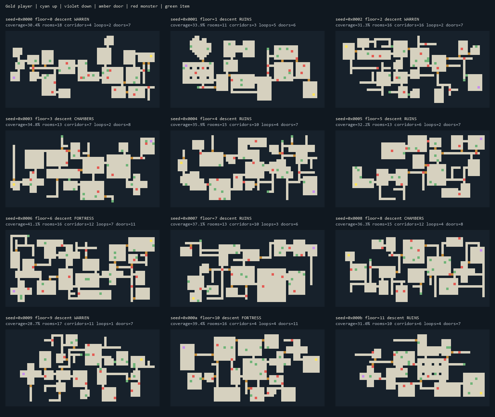

# Floor generation replacement

The fixed 4×3 room grid has been replaced with connected feature growth, followed
by independent loop, door, stair, and population phases. Saved `Game` layout and
save version 23 are unchanged. Combat, item effects, equipment definitions,
visibility, rendering, controls, and progression retain their existing behavior.

1. **Architecture.** `world_gen.cpp` owns floor reset and the phase sequence;
   runtime world/FOV code stays in `world.cpp`. One six-byte descriptor describes
   only the feature currently being attempted. A full-period odd-stride scan
   finds an attachment boundary without a frontier list. Growth stops at a
   variable coverage target or 1,800 attempts; late attempts favor small rooms.
   Every feature connects to existing terrain through a valid socket. The outer
   two rows/columns stay solid. No room graph, heap, recursion, or large local
   array is needed.
2. **Procedural families.** Small rectangles (4–7), medium rectangles (6–10),
   large rectangles (8–14), short straight passages (3–7), long straight passages
   (8–15), and bent passages with variable legs. Rectangles/passages dominate
   successful features, while dimensions and orientation vary.
3. **Handcrafted families and representation.** L, cross, T, double chamber,
   pillared hall, long gallery, alcove, wide hall, and two irregular chambers.
   Each flash template has packed 16-bit carve rows, constexpr-generated
   clearance rows, and a transform enable mask. All four rotations and their
   horizontal reflections are supported without duplicating bitmaps. Each
   record has a 64-byte stride to avoid expensive AVM address multiplication;
   the ten records occupy 640 flash bytes. Sockets are derived from row masks.
4. **Archetypes.** CHAMBERS, WARREN, FORTRESS, and RUINS use flash weighting
   tables and small coverage/loop/door parameters. Selection hashes the layout
   seed rather than cycling by depth. Ruins allow diagonal clearance contact and
   explicitly validated three-wide openings between room faces. Mixed archetypes
   are deferred.
5. **Loops.** Scan for one-to-three-cell connectors with solid lateral walls.
   Reject candidates whose endpoints already have a short route (12–18 steps,
   according to archetype). Exact synchronous cardinal propagation uses two
   92-byte bit planes within `game.explored`, with no BFS queue. The local window
   contains every route within the rejection threshold. Native topology checks
   verify each accepted connector increases graph cycle rank by exactly one.
6. **Stairs.** Choose a random roomy tile, then alternate farthest squared-distance
   scans three times. Both stairs require a full floor 3×3 neighborhood and avoid
   doors; their assignment is randomized independently. Descending players start
   at up stairs; ascending players start at down stairs.
7. **Doors.** Candidates come from real attachment boundaries. Room/passage
   transitions outrank room/room transitions; passage/passage connections get no
   door. Temporarily use spare coordinate bits in the existing door slots for
   priority. Keep the strongest subset within archetype caps (8/7/11/7), then
   remove invalid, adjacent, or duplicate candidates after loops. All temporary
   bits and unused slots are cleared before gameplay.
8. **Population.** `world_gen_population.cpp` enumerates floor tiles through
   allocation-free odd-stride scans, with preferences for chambers, junctions,
   and occasional dead-end loot. Monsters/items avoid walls, doors, stairs, and
   occupied tiles. Monsters prefer spacing and stay at least six tiles from the
   early-floor spawn, four later. Encounter weights, health, mimic disguises,
   supply weights, and equipment subtype/enchantment/curse philosophy remain.
   The final descending Lord guards down stairs; ground slot 15 remains reserved
   for its Yendor drop. Ascent gets fresh threats and no ordinary supplies.
9. **Randomness.** Seven purpose constants select independent 16-bit mixed seeds
   from run seed, depth, and ascent state: layout, loops, doors, stairs, monsters,
   supplies, equipment. Slot-specific placement streams keep searches/rejections
   from changing content rolls. Layout perturbation tests retain identical
   monster types/disguises and item type/info. Gameplay `random_state` is untouched;
   scratch is cleared even on ascent.

Measured production resources, using the installed AVM SDK:

| Metric | Before | After | Change |
| --- | ---: | ---: | ---: |
| `.saved` | 773 B | 773 B | 0 |
| `.data` | 102 B | 102 B | 0 |
| `.bss` | 0 B | 0 B | 0 |
| Permanent RAM | 875 / 1,024 B | 875 / 1,024 B | 0 |
| Production maximum stack | 238 / 256 B | 238 / 256 B | 0 |
| Benchmark maximum stack | 236 / 256 B | 236 / 256 B | 0 |
| `.text` | 49,533 B | 58,245 B | +8,712 B |
| `.rodata` | 5,896 B | 6,636 B | +740 B |

10. **RAM:** unchanged, with 149 bytes of permanent RAM available.
11. **Stack:** both SDK bounds are complete, with zero analysis gaps. Phase
    boundaries deliberately prevent LTO from combining generation locals into
    unsafe frames. The maximum production path remains the existing wand/status/
    rendering path, with 18 bytes of margin.
12. **Flash:** combined code/constant growth is 9,452 bytes. The rebuilt
    `ardurogue2.arduboy` is included at the project root.
13. **Native tests:** all eight CTest entries pass, including bulk properties,
    existing combat/equipment/persistence/progression checks, visibility oracle,
    UI, rendering, and benchmark helpers. Deterministic snapshots cover four
    seeds × sixteen depths × both travel states. Template tests independently
    verify every family/transform's carve and clearance masks. The synthetic
    rendering corridor now uses fixed stairs so its goldens are independent of
    generation.
14. **Turn benchmarks:** all 21 cases pass the 100 ms worst-sample requirement.
    Slowest is `wait_dense`, **75.340 ms**, leaving 24.660 ms. Final profiles and
    named before/after states are in
    `build/turn-benchmarks/20261005T053137Z-cx8wfbt1/`.
15. **Bulk results:** 131,072 floors from 4,096 run seeds, all sixteen depths,
    ascent and descent. Every connectivity, bounds, door, stair, entity, scratch,
    determinism, and RNG-isolation check passed. The sample has 55,974 distinct
    layout seeds and **55,974 distinct terrain hashes**. Collisions between floor
    identities reflect the deliberately 16-bit layout stream, not identical
    output from different sampled layout seeds. Minimum floor size is 533 tiles,
    minimum major chamber count six, minimum stair separation 32.98 tiles, and
    every stair/spawn has a full floor 3×3 neighborhood.

| Style | Floors | Coverage | Major chambers | Doors | Added loops | Dead ends | Narrow junctions | Mean stair distance |
| --- | ---: | ---: | ---: | ---: | ---: | ---: | ---: | ---: |
| CHAMBERS | 32,960 | 35.83% | 13.17 | 7.86 | 2.94 | 6.46 | 12.08 | 54.16 |
| WARREN | 32,767 | 29.68% | 15.56 | 6.89 | 1.99 | 9.87 | 18.04 | 51.73 |
| FORTRESS | 32,424 | 39.42% | 13.51 | 10.89 | 5.45 | 5.86 | 13.27 | 55.56 |
| RUINS | 32,921 | 34.45% | 13.20 | 6.31 | 3.41 | 5.88 | 12.34 | 53.57 |

Coverage/geometry values are means. Full ranges, feature-family counts, cycle
rank, spawn safety, and attempts are in [the statistics](floor-generation-statistics.csv).
Grid cycle rank also counts the ordinary cycles within room interiors; the
separate added-loop metric measures the deliberate connector pass.

Production emulator audits compare 701 generated-state bytes with the native
oracle, including terrain, scratch, doors, entities, stairs, and spawn, and check
the untouched gameplay RNG. Checks passed for all four archetypes, final-floor
descent, final-floor ascent, and seed `0x1234` at depth zero. Sample generation
times span roughly **4.9–12.4 seconds** at emulated 16 MHz. During development,
packed mask/socket/clearance changes reduced seed `0x1234`, floor zero from
41.15 seconds to **5.97 seconds**, with no RAM increase. Generation is excluded
from the turn benchmark as requested.

16. **Visual review:** 48 maps were reviewed in four contact sheets, plus ASCII
    samples during tuning. [Representative ASCII maps](floor-examples.md) cover
    explicit seeds for every archetype. The retained 48-map SVG/HTML gallery is
    `build/generation/gallery/index.html`; reproduce it with the command below.



17. **Remaining tuning:** generation still takes several seconds on AVM, and
    crowded layouts can take longer. Loop targets are best effort; some valid
    layouts have no useful short connector. Longer connections could create more
    opportunities but would need careful geometry validation. Stair selection
    maximizes geometric separation rather than full walking distance. Mixed
    archetypes are not implemented. These limitations do not affect tested
    connectivity, population validity, or RAM/stack limits.

Reproduce from the project directory (`<sdk>` is the installed SDK; native
executable paths vary by generator/platform):

```text
cmake -S . -B build -DCMAKE_BUILD_TYPE=RelWithDebInfo -DAVM_SDK_ROOT=<sdk>
cmake --build build --config RelWithDebInfo --target ardurogue2 ardurogue2_bench
cmake -S . -B build/native -DCMAKE_BUILD_TYPE=RelWithDebInfo
cmake --build build/native --config RelWithDebInfo
ctest --test-dir build/native -C RelWithDebInfo --output-on-failure
python bench/profile_turns.py --elf build/ardurogue2-bench.elf --sdk-root <sdk> --check --output build/turn-benchmarks
build/native/tests/game_native --floor-bulk 4096
build/native/tests/game_native --floor-map 0x1234 7 ascent
build/native/tests/game_native --floor-batch 48
python tools/preview_floors.py --native build/native/tests/game_native --count 48 --output build/generation/gallery
python tools/check_floor_avm.py --elf build/ardurogue2.elf --native build/native/tests/game_native --sdk-root <sdk> --seed 0xffff --floor 15 --ascent --output build/generation/avm
```

SVG/HTML generation uses only Python's standard library; PNG contact sheets are
also written when Pillow is installed. `check_floor_avm.py --profile` retains an
AVM generation profile. All diagnostic state and mask oracles are host-only.
Raw memory/stack reports, bulk output, emulator comparisons, and profiles remain
in the ignored `build/generation/` directory.

Final production ELF SHA-256:
`6e18202d8cf24904827a4d3f15343e24df594cae5b2cddd5b02ba0bac4a365e0`.

Final benchmark ELF SHA-256:
`91b7e6cdc989b926b5dbd460bfd7ab73c786a0bf45ce6c32ec86035dd4d26585`.
